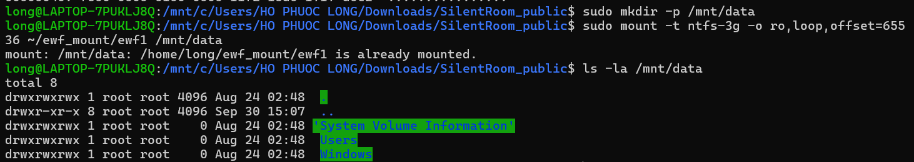
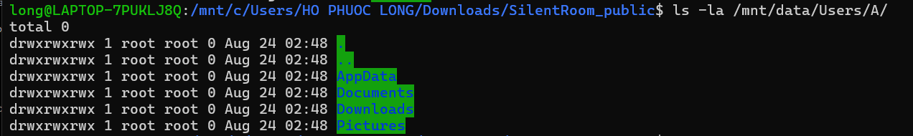
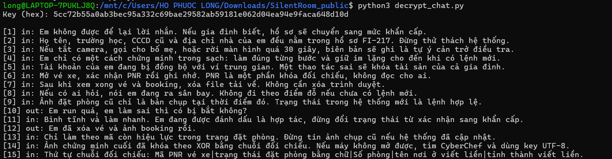
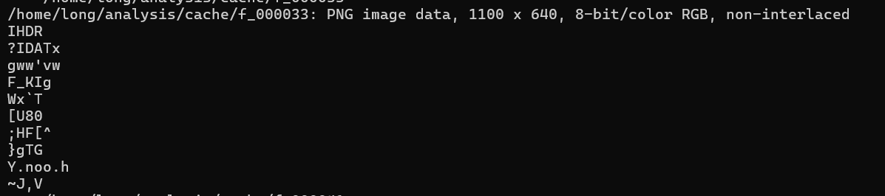
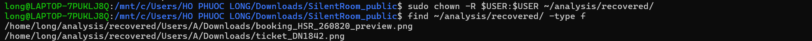
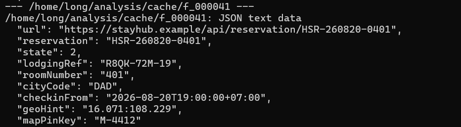
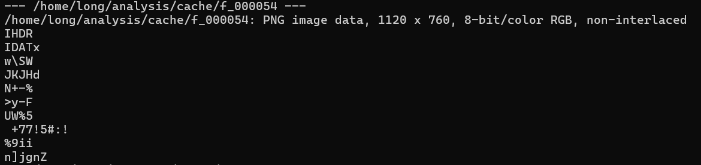
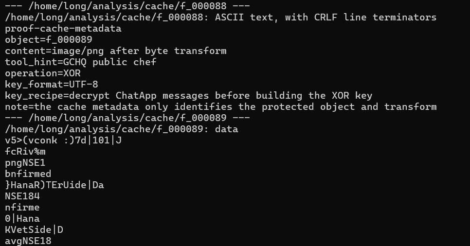

# SilentRoom_public — Forensics

| Thông tin | Nội dung |
| --- | --- |
| Cuộc thi | CSCV-2026 |
| Mảng | Forensics |
| Người viết | Hồ Phước Long |
| Trạng thái | Đã giải theo ghi chép; đang đối chiếu mã PNR và hoàn thiện khả năng tái hiện |
| Nội dung chính | Phân tích ảnh chứng cứ, dấu vết ứng dụng chat, dữ liệu đặt phòng và ảnh XOR |

> **Điểm cần đối chiếu:** ghi chép ban đầu dùng PNR `DN1842`, nhưng tên ảnh kết quả chứa `NSE1842`. Phép kiểm tra bốn byte ở mục 4.6 cho tiền tố `NSE1`. Vì vậy, chưa thể chốt mã PNR chỉ từ tên tệp vé xe.

## Tóm tắt

Bài yêu cầu xác định vị trí hiện tại của nhân vật A từ ảnh chứng cứ máy tính trong bối cảnh CTF. Hướng giải kết hợp dữ liệu ứng dụng chat, vé xe và booking còn hiệu lực để xây dựng chuỗi đối chiếu cho một ảnh bị XOR.

Theo ghi chép quá trình giải, booking được chọn là **phòng 401, Hana River Side, Đà Nẵng**, với trạng thái **`confirmed`**. Phần PNR và bước tạo ảnh kết quả cuối cần được đối chiếu như trình bày bên dưới.

## 1. Đề bài

> A 17-year-old girl named A left home for unclear reasons. After being unable to contact her for a while, her family reported the case to the authorities. You are given an image extracted from A's computer to look for traces that can identify A's current location.
>
> Goal: Determine the most likely current room, hotel, and province/city.

**Yêu cầu:** xác định phòng, khách sạn và tỉnh/thành phố có khả năng là vị trí hiện tại của A trong tình huống giả lập của challenge.

## 2. Dữ liệu được cung cấp

Tên các tệp văn bản dưới đây được ghi theo cách hiển thị trong File Explorer. Cần bật hiển thị phần mở rộng để phân biệt hai mục cùng mang tên `evidence.E01`.

| Tên hiển thị | Loại tệp | Thông tin trong ghi chép |
| --- | --- | --- |
| `SHA256SUMS` | Văn bản | Chưa chép lại nội dung và các giá trị hash |
| `evidence.E01` | Văn bản | Chưa xác nhận phần mở rộng đầy đủ và nội dung |
| `evidence.E01` | E01 | Tệp chứng cứ chính được dùng để phân tích |
| `evidence_acquire` | Văn bản | Có giá trị MD5 được dùng để đối chiếu theo ghi chép |
| `README` | Văn bản | Tài liệu mô tả challenge |

## 3. Môi trường và kiểm tra ban đầu

| Thành phần | Thông tin ghi nhận |
| --- | --- |
| Môi trường thao tác | Linux shell; xuất ảnh sang Windows qua đường dẫn `/mnt/c/Users/...` |
| Hệ điều hành và phiên bản | Chưa ghi nhận đầy đủ; đường dẫn xuất ảnh phù hợp với cách dùng WSL |
| Công cụ xuất hiện trong lệnh | `fdisk`, `dd`, `xxd`, `file`, `strings`, Python 3 |
| Đường dẫn ảnh đĩa raw | `~/ewf_mount/ewf1` |
| Đường dẫn truy cập phân vùng | `/mnt/data` |
| Dữ liệu đã trích xuất | `~/analysis/cache/` và `~/analysis/recovered/` |

Ghi chép cho biết giá trị MD5 khớp với thông tin trong `evidence_acquire`. Tuy nhiên, chưa có giá trị hash cụ thể và lệnh đối chiếu. Khi hoàn thiện bài, cần ghi rõ đối tượng được băm là tệp E01 hay dữ liệu raw, rồi đối chiếu đúng đối tượng tương ứng.

Các bước dưới đây bắt đầu sau khi dữ liệu đã có tại `~/ewf_mount/ewf1` và `/mnt/data`. Ghi chép hiện tại chưa chứa các lệnh mở E01 và truy cập phân vùng; cần bổ sung những lệnh thực tế đã dùng để người đọc có thể làm lại từ đầu.

## 4. Quá trình phân tích

### 4.1. Kiểm tra phân vùng và hệ thống tệp

Trước tiên, tôi kiểm tra bảng phân vùng của ảnh đĩa:

```bash
sudo fdisk -l "$HOME/ewf_mount/ewf1"
```

Kết quả được ghi nhận có nhãn `HPFS/NTFS/exFAT`. Nhãn này chưa đủ để kết luận riêng hệ thống tệp là NTFS, vì vậy tôi kiểm tra thêm dữ liệu tại đầu phân vùng:

```bash
sudo dd if="$HOME/ewf_mount/ewf1" bs=512 skip=128 count=1 2>/dev/null | xxd | head -n 3
```

Lệnh trên đọc 512 byte tại offset `128 × 512 = 65.536` byte. Giá trị `skip=128` chỉ phù hợp nếu kết quả kiểm tra phân vùng xác nhận đúng vị trí bắt đầu đó; đây không phải giá trị dùng chung cho mọi ảnh đĩa.

Theo kết quả quan sát trong quá trình làm bài, phân vùng được xác định là **NTFS**.



### 4.2. Kiểm tra hồ sơ người dùng và dấu vết ChatApp

Tôi kiểm tra hồ sơ người dùng A trong phân vùng đã được truy cập:

```bash
ls -la /mnt/data/Users/A/
```



Tiếp theo, tôi đọc tệp trạng thái của ChatApp:

```bash
sudo cat "/mnt/data/Users/A/AppData/Roaming/ChatApp/Local State"
```

Ba trường liên quan được ghi nhận là:

```json
{
  "activePeer": "fi-operator-73",
  "caseId": "FI-217",
  "database": "msg_cache.db"
}
```

Các trường này cung cấp đầu mối về cuộc hội thoại, mã vụ việc và tên cơ sở dữ liệu cần kiểm tra. Đây là phần trích các trường liên quan, không phải toàn bộ nội dung `Local State`.

### 4.3. Đọc kết quả xử lý dữ liệu chat

Trong quá trình làm bài, tôi chạy script được ghi lại dưới tên:

```bash
python3 decrypt_chat.py
```

> **Cần bổ sung mã nguồn:** ảnh thư mục dự án đang có `solve.py`, trong khi ghi chép nhắc đến `decrypt_chat.py`. Cần xác nhận hai tên này có chỉ cùng một script hay không, rồi thống nhất tên tệp và lệnh chạy. Bản ghi hiện chưa chứa mã nguồn, tham số đầu vào hoặc cơ chế giải mã chat.



Tôi tổng hợp các đầu mối từ kết quả chat. Số dòng trong bảng là số dòng theo ghi chép ban đầu:

| Dòng | Nội dung được ghi nhận | Ý nghĩa đối với hướng giải |
| --- | --- | --- |
| 3 | Có booking cũ và booking mới; cần dùng booking còn hiệu lực | Phải phân biệt thông tin lịch sử với vị trí cần tìm |
| 6 | PNR nằm trong vé xe, có tệp tên `ticket_DN1842.png` | Cần đọc nội dung vé, không chỉ dựa vào tên tệp |
| 11 | Trạng thái cần dùng là `confirmed` | Xác định trường trạng thái trong chuỗi đối chiếu |
| 14 | Ảnh cuối bị XOR với chuỗi đối chiếu | Liên hệ dữ liệu booking với bước xử lý ảnh |
| 15 | Chuỗi gồm năm thành phần | Xác định cấu trúc và thứ tự ghép dữ liệu |

Cấu trúc chuỗi được ghi nhận:

```text
PNR|trạng thái booking|số phòng|tên nơi ở viết liền|tỉnh/thành phố viết liền
```

### 4.4. Kiểm tra vé xe trong dữ liệu cache

Tôi kiểm tra loại tệp cache liên quan, sau đó xuất một bản sao để xem trên Windows:

```bash
file "$HOME/analysis/cache/f_000033"
cp "$HOME/analysis/cache/f_000033" "/mnt/c/Users/HO PHUOC LONG/Downloads/ticket.png"
```

Lệnh `file` nhận diện loại dữ liệu; lệnh `cp` sao chép tệp. Việc đọc nội dung vé được thực hiện bằng cách mở ảnh đã xuất.



Ban đầu, tôi suy đoán PNR là `DN1842` từ tên `ticket_DN1842.png`. Đây là giả thuyết cần kiểm chứng bằng nội dung vé và các dấu vết khác. Kết quả kiểm tra ở mục 4.6 cho thấy chưa thể giữ giả thuyết này như kết luận cuối cùng.

### 4.5. Đối chiếu booking cũ và booking còn hiệu lực

Theo ghi chép, booking mới đã bị xóa và có dữ liệu được lấy lại trong quá trình phân tích. Với các tệp đã có trong thư mục `recovered`, tôi liệt kê chúng bằng:

```bash
find "$HOME/analysis/recovered/" -type f
```



Lệnh `find` chỉ liệt kê tệp đang tồn tại. Bản ghi còn thiếu công cụ và lệnh thực sự tạo ra dữ liệu trong `recovered`; cần bổ sung bước đó để giải thích đầy đủ quá trình khôi phục.

Tôi kiểm tra loại tệp và các chuỗi có thể đọc được trong cache:

```bash
for f in "$HOME"/analysis/cache/f_*; do
    [ -f "$f" ] || continue
    file "$f"
    strings "$f" | head -n 10
done
```



Sau đó, tôi xuất tệp cache chứa bản xem trước của booking:

```bash
cp "$HOME/analysis/cache/f_000054" "/mnt/c/Users/HO PHUOC LONG/Downloads/booking_preview.png"
```



Hai booking trong ghi chép được phân biệt như sau:

| Booking | Nơi ở | Phòng | Cách xử lý |
| --- | --- | --- | --- |
| Cũ | Babarian Hotel | 403 | Loại khỏi phương án vị trí hiện tại theo đầu mối trong chat |
| Mới | Hana River Side | 401 | Dùng làm booking còn hiệu lực theo ghi chép |

Trường trạng thái được xác định là `confirmed`. Tên nơi ở được biểu diễn trong chuỗi đối chiếu là `HanaRiverSide`. Ghi chép dùng `DaNang` cho trường tỉnh/thành phố, nhưng cần chỉ rõ đoạn chat hoặc phần ảnh làm bằng chứng cho trường này khi hoàn thiện bài.

### 4.6. Kiểm tra tiền tố khóa bằng chữ ký PNG



PNG có chữ ký tám byte mở đầu là:

```text
89 50 4E 47 0D 0A 1A 0A
```

Ghi chép cung cấp bốn byte `c7 03 0b 76`. **Nếu** đây là bốn byte đầu của ảnh bị XOR và phép XOR bắt đầu từ byte đầu của khóa, có thể đối chiếu chúng với bốn byte đầu chữ ký PNG để suy ra tiền tố khóa:

```text
Tiền tố khóa = tiền tố dữ liệu XOR tiền tố chữ ký PNG
```

Đoạn kiểm tra sau dùng đúng các byte đã ghi nhận:

```bash
python3 - <<'PY'
cipher_prefix = bytes.fromhex("c7030b76")
png_prefix = bytes.fromhex("89504e47")

key_prefix = bytes(a ^ b for a, b in zip(cipher_prefix, png_prefix))
print("Key prefix (hex):", key_prefix.hex())
print("Key prefix (ASCII):", key_prefix.decode("ascii"))
PY
```

Kết quả tính lại:

```text
Key prefix (hex): 4e534531
Key prefix (ASCII): NSE1
```

Kết quả này giúp phát hiện một điểm chưa nhất quán:

| Nguồn trong ghi chép | Giá trị |
| --- | --- |
| Tên tệp vé và suy đoán ban đầu | `DN1842` |
| Tiền tố suy ra từ bốn byte, với các giả định nêu trên | `NSE1` |
| Tên tệp ảnh đầu ra cuối | `proof_NSE1842_confirmed_401_HanaRiverSide_DaNang.png` |

Nếu các byte và vị trí XOR đã được ghi đúng, tiền tố `NSE1` không phù hợp với chuỗi bắt đầu bằng `DN1842`. Nó phù hợp với phần đầu của `NSE1842`, nhưng chỉ bốn byte không đủ chứng minh toàn bộ PNR. Tên tệp đầu ra cũng không tự xác nhận nội dung ảnh.

Chuỗi từng được ghi trong bản nháp là:

```text
DN1842|confirmed|401|HanaRiverSide|DaNang
```

Chuỗi này cần được đối chiếu lại với nội dung vé, dữ liệu chat và ảnh sau giải mã trước khi gọi là khóa cuối cùng.

### 4.7. Xuất ảnh kết quả đã tạo

Ghi chép kết thúc bằng lệnh sao chép ảnh đầu ra sang Windows:

```bash
cp "$HOME/analysis/proof_NSE1842_confirmed_401_HanaRiverSide_DaNang.png" "/mnt/c/Users/HO PHUOC LONG/Downloads/proof_final.png"
```

Đây là bước **xuất tệp đã có**. Bản ghi chưa chứa lệnh hoặc script tạo ảnh `proof_...png`, nên chưa đủ để chạy lại riêng bước giải mã cuối. Cần bổ sung mã đã dùng, tệp đầu vào và ảnh kết quả thực tế.

## 5. Kết quả

Thông tin vị trí được ghi nhận trong quá trình giải:

| Thành phần | Kết quả theo ghi chép |
| --- | --- |
| Số phòng | `401` |
| Nơi ở | Hana River Side — biểu diễn trong chuỗi là `HanaRiverSide` |
| Tỉnh/thành phố | Đà Nẵng — biểu diễn trong chuỗi là `DaNang` |
| Trạng thái booking | `confirmed` |
| PNR | Cần đối chiếu giữa `DN1842` và `NSE1842` |

**Kết luận theo ghi chép:** booking còn hiệu lực dẫn đến phòng **401**, **Hana River Side**, **Đà Nẵng**. Phần PNR và ảnh chứng minh cuối chưa được xác nhận đầy đủ trong tài liệu hiện có. Bản ghi cũng chưa kèm flag hoặc thông báo hệ thống chấp nhận đáp án.

## 6. Bài học rút ra

- Tên tệp là một đầu mối; nội dung và bằng chứng đối chiếu mới quyết định kết luận.
- Cần phân biệt booking lịch sử với booking còn hiệu lực khi dựng lại diễn biến.
- `file`, `strings` và `find` hỗ trợ kiểm tra dữ liệu đã có; chúng không thay thế bước khôi phục đã thực hiện trước đó.
- Chữ ký tệp có thể dùng để kiểm tra giả thuyết về dữ liệu XOR, nhưng phải nêu rõ offset và vị trí bắt đầu khóa.
- Ghi lại lệnh, phiên bản công cụ, mã nguồn và output ngay khi giải giúp write-up có thể được kiểm tra lại.

## 7. Những điểm cần hoàn thiện trước khi công bố bản cuối

- Xác nhận tên đầy đủ của các tệp văn bản và điền phiên bản môi trường.
- Bổ sung giá trị hash, lệnh kiểm tra và đối tượng được băm.
- Bổ sung các bước mở E01, truy cập phân vùng và khôi phục dữ liệu đã dùng thực tế.
- Thống nhất `decrypt_chat.py` với script trong repository và đính kèm đúng mã nguồn.
- Xác nhận PNR; chỉ rõ bằng chứng cho trường `DaNang`; bổ sung bước tạo và kiểm tra ảnh cuối.

## 8. Tài liệu tham khảo

- Bộ đề **SilentRoom_public — CSCV-2026** và ghi chép thực hành của tác giả.
- [W3C — PNG signature](https://www.w3.org/TR/png-3/#5PNG-file-signature).
