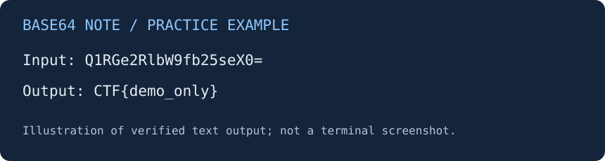

# Base64 Note — ví dụ tự luyện

| Thuộc tính | Nội dung |
| --- | --- |
| Mảng | Misc / Encoding |
| Nguồn | Ví dụ do trợ lý tạo để hướng dẫn viết write-up |
| Độ khó | Nhập môn, đánh giá của người soạn |
| Mục tiêu | Đọc một chuỗi được mã hóa biểu diễn Base64 |
| Công cụ đã kiểm tra | Python 3.12.14, Linux, thư viện chuẩn |

## Tóm tắt

Đầu vào là một chuỗi ASCII ngắn. Hình dạng gợi ý Base64 nhưng chưa đủ để kết luận; tôi kiểm tra cú pháp và giải mã, sau đó đối chiếu văn bản đầu ra. Bài này minh họa giải mã biểu diễn, không phải khai thác lỗi hoặc phá thuật toán mật mã.

## Đề bài và dữ liệu

Tệp [data.txt](data.txt) chứa:

```text
Q1RGe2RlbW9fb25seX0=
```

Trong ví dụ giả lập, cần tìm thông điệp có dạng `CTF{...}`.

SHA-256 của file `data.txt` đi kèm (bao gồm một ký tự xuống dòng LF ở cuối):

```text
02ac12168ee17cab5f36942e29914af856970857af1f4700145503aa12646814
```

## Quan sát, giả thuyết và kiểm chứng

Chuỗi có 20 ký tự sau khi bỏ xuống dòng cuối. Nó dùng các ký tự phù hợp với Base64 và có dấu `=` ở cuối. Đây là cơ sở để thử Base64, chưa chứng minh rằng dữ liệu có ý nghĩa hay bí mật được bảo vệ bằng mật mã.

| Quan sát | Giả thuyết | Kiểm tra | Kết luận |
| --- | --- | --- | --- |
| Ký tự và độ dài phù hợp | Có thể là Base64 | Giải mã với kiểm tra cú pháp | Đầu vào được chấp nhận |
| Có dữ liệu byte sau giải mã | Có thể là văn bản UTF-8 | Giải mã byte thành UTF-8 | Thu được chuỗi đọc được |
| Văn bản có dạng yêu cầu | Có thể là kết quả bài giả lập | Đối chiếu mục tiêu đề | Phù hợp với ví dụ |

## Phần mã cần hiểu

```python
encoded = source.read_text(encoding="ascii").strip()
decoded = base64.b64decode(encoded, validate=True)
print(decoded.decode("utf-8"))
```

`strip()` bỏ xuống dòng ở hai đầu. `validate=True` giúp phát hiện các ký tự không hợp lệ và lỗi padding mà bộ giải mã kiểm tra; đây không phải bằng chứng về nguồn gốc dữ liệu. Kết quả Base64 là byte, vì vậy cần bước giải mã UTF-8 riêng.

Mã đầy đủ nằm trong [solve.py](solve.py). File đọc dữ liệu theo vị trí của chính script, nên không phụ thuộc vào thư mục terminal đang đứng. Không cần cài thêm thư viện.

## Chạy và đối chiếu

Từ thư mục gốc `ctf-writeups`, chạy:

```bash
python 2026/practice/misc/base64-note/solve.py
```

Nếu hệ thống đặt lệnh Python 3 là `python3`, thay `python` bằng `python3`. Trên Windows có Python Launcher, có thể thay bằng `py -3`.

Đầu ra đã chạy kiểm tra, cũng được lưu ở [output.txt](output.txt):

```text
CTF{demo_only}
```



Hình trên là bản minh họa văn bản, không phải ảnh chụp terminal. Đây là flag giả của ví dụ; không có nền tảng thi nào xác nhận kết quả.

## Bài học

- Dấu `=` là dấu hiệu để hình thành giả thuyết, không phải kết luận chắc chắn.
- Base64 là một phép biểu diễn dữ liệu, không cung cấp tính bí mật.
- Tách rõ quan sát ban đầu, phép kiểm tra và kết quả thực tế giúp người đọc theo được lập luận.
- Lệnh chạy, dữ liệu đầu vào và output đối chiếu giúp người khác kiểm tra bài viết.

## Nguồn tham khảo

[Tài liệu Python về Base64](https://docs.python.org/3/library/base64.html).
